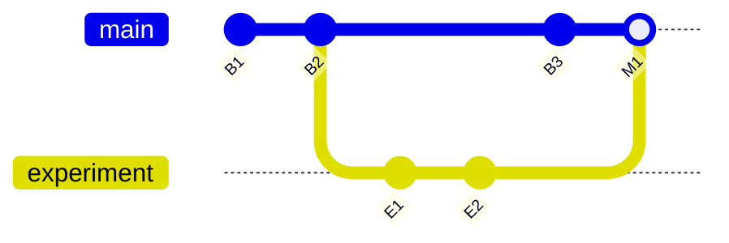

# 机台知识库与变更管理需求设计文档

> 文档状态：需求基线草案，待评审
> 目标阶段：V0.3 之后，具体版本待排期
> 适用范围：机台类型基线、机台实例模型、状态—活动知识图谱、版本与分支、选择性回写、求解重放
> 当前实现说明：本文描述目标需求，不代表当前系统已经具备全部能力。当前状态/活动本体—引用收敛前置见 [TICKET-097](./TICKET_097.md)。

---

## 1. 背景

当前系统已经能够维护机台类型、具体设备、状态、活动、规则、资源、工作日历和状态—活动网络，并能通过 Planner / Scheduler 生成计划。

随着数据量和实际设备数量增加，现有“直接维护当前值”的方式会遇到以下问题：

- 同一类型的机台需要复用大量相同能力和工艺数据，但不同具体设备又存在少量真实差异；
- 机台类型基线早期不成熟，需要从具体设备的实践中持续吸收有效变化；
- 当前数据持续被修改后，难以准确回答某次求解究竟使用了哪一版状态、活动、规则和关系；
- 同一个模型可能同时存在主路径、实验分支和现场实例变体，需要可控合并；
- 节点相同但边不同、节点改名、关系端点变化等情况，不能只靠表格字段覆盖处理；
- 数据模型和网络图需要同时服务人和机器，既能被业务人员阅读，也能被求解器、校验器和自动化工具稳定消费；
- 模型规模扩大后，完整复制每个版本会造成明显存储浪费，运行时叠加大量差异又会增加解析、调试和重放复杂度。

因此，需要在现有求解系统之上建设：

> **以“机台类型基线 + 机台实例”为两层业务语义，以不可变版本、内容复用和知识图谱为底座的机台知识库与变更管理能力。**

---

## 2. 产品目标

系统需要实现以下目标：

1. 机台类型作为可复用的能力与工艺基线。
2. 机台实例作为具体集成设备的有效模型。
3. 同一类型下，不同机台实例允许拥有不同原子状态、原子活动、规则、资源配置和关系。
4. 机台实例默认冻结在一个明确的基线版本，不随主基线自动漂移。
5. 实例变化可以选择性提出回写，不直接覆盖基线。
6. 基线和实例都形成不可变版本历史，可分支、比较和合并。
7. 相同内容只保存一次；新版本复用未变化对象。
8. 每个已提交版本在逻辑上都是完整模型，不依赖求解时临时叠加一串差异。
9. 历史求解保存当次有效模型版本、输入摘要和必要快照，支持后续重放。
10. 状态、活动、规则、包成员和语义边共同形成统一知识图谱，图形界面和求解接口读取同一份 canonical 数据。

---

## 3. 非目标

本需求不是：

- 用 Git 仓库直接替代业务数据库；
- 把每个机台实例完整复制成一套互不关联的数据；
- 在每次求解时临时执行复杂的“基线 + 多层差异”覆盖解析；
- 把网络编辑器升级成无业务约束的通用画图工具；
- 自动把所有实例变化同步回类型基线；
- 自动解决所有语义冲突；
- 实时采集和管理设备运行遥测；
- 继续扩展维护意图模板。维护意图已按产品决策废弃，不进入本需求。

---

## 4. 核心原则

### 4.1 业务语义只有两层

系统只保留两层业务语义：

```text
机台类型基线
    ↓ 派生
机台实例
```

不在业务层继续引入“类型覆盖层、实例覆盖层、临时解析层、维护意图层”等额外层级。

版本、提交、分支和对象存储属于变更管理基础设施，不构成新的业务模型层。

### 4.2 版本逻辑完整，存储物理复用

每个基线版本和实例版本都必须能够独立回答：

> 这个版本的完整有效模型是什么？

逻辑上，每个版本都是完整模型；物理上，不重复保存未变化的对象。

```text
Revision B
  ├─ 继续引用 Revision A 未变化的对象
  ├─ 引用新建或修改后的对象
  └─ 不引用本版本已删除的对象
```

求解器读取一个明确版本的完整清单，不在运行时逐层叠加差异。

### 4.3 身份与内容分离

每个业务实体和语义关系具有稳定身份；对象内容可以随版本改变。

```text
stable identity != content hash
```

- 改名称不会改变身份；
- 改编码默认也不改变身份；
- 内容变化会产生新的内容对象和内容哈希；
- 同一身份在不同版本中可以指向不同内容对象；
- 两个不同身份如果内容完全相同，可以共享同一个内容对象。

### 4.4 关系是一等知识对象

知识图谱中的边不是临时画线，而是有身份、类型、端点、属性和版本的语义关系。

例如：

- 状态包成员引用；
- 活动包原子活动引用；
- 原子活动输入状态；
- 原子活动产出状态；
- Scope Guard 前置关系；
- 规则资源需求；
- 日历或规则适用关系。

边的端点或关系类型变化，按“删除旧关系 + 新建关系”处理；只修改排序、启用、说明或布局等非端点属性时，可以保留关系身份。

### 4.5 图是投影，不是第二套事实

网络图、资源树、表格、文本摘要、API 和求解器输入必须由同一 canonical 知识模型派生。

画布布局、折叠状态、代理边和 relay 节点属于展示投影；它们不能替代真实业务实体和语义关系。

### 4.6 所有同步都必须显式

- 实例不会因基线更新而自动改变；
- 基线不会因实例修改而自动改变；
- 回写、升级、合并都必须经过差异预览、校验和确认；
- 任何自动合并都必须可解释、可撤销并生成新版本。

---

## 5. 核心术语

| 术语 | 定义 |
|---|---|
| 机台类型 | 一类机台的业务分类，也是可复用能力与工艺基线的归属根 |
| 基线 | 某个机台类型在一个时点被确认的完整知识模型 |
| 基线版本 | 基线的一次不可变提交 |
| 基线主路径 | 机台类型默认使用的基线分支，例如 `main` |
| 机台实例 | 一台具体的集成设备，是实际状态、求解和现场差异的归属对象 |
| 实例版本 | 某台机台在一个时点的完整有效模型 |
| 冻结基线 | 实例当前明确绑定的基线版本 |
| 有效模型 | 某个基线版本或实例版本中可供校验、求解和展示的完整实体与关系集合 |
| 知识实体 | 状态、状态包、活动、活动包、规则、资源、日历、状态维度等有稳定身份的对象 |
| 语义关系 | 包成员、活动输入/输出、规则需求、Scope Guard 等有稳定身份的边 |
| 内容对象 | 按 canonical 内容计算哈希的不可变存储对象 |
| 清单 | 一个版本对全部实体身份、关系身份及其内容对象的完整映射 |
| 提交 | 指向一个完整清单、父提交和变更说明的不可变版本记录 |
| 分支 | 指向某个提交的可移动名称 |
| 变更集 | 两个版本之间按实体和关系计算出的新增、修改、删除集合 |
| 回写 | 从实例变更中选择部分内容，经校验后合入机台类型基线 |
| 实例升级 | 将实例从当前冻结基线迁移到更新基线，同时保留实例自身差异 |
| 三方合并 | 使用共同基础版本对当前主线和待合入版本进行比较和合并 |
| 重放 | 使用历史求解记录的有效模型版本和必要输入重新构造或再次运行求解 |

现有界面中的“设备类型 / 设备实例”是历史术语，业务文档后续统一映射为“机台类型 / 机台实例”。

---

## 6. 业务对象模型

### 6.1 机台类型基线

机台类型基线是可复用的能力与工艺模板，至少包括：

- 状态维度；
- 状态本体和状态包；
- 状态包成员引用；
- 活动包和原子活动；
- 活动包原子活动引用；
- 原子活动输入/输出状态绑定；
- 工序规则、前置条件、效果和资源需求；
- Scope Guard；
- 工作日历和排期规则；
- 资源类型或通用资源需求；
- 网络图语义关系；
- 必要的业务说明、来源和治理元数据。

基线不表示某台具体设备的当前状态，也不保存实例现场观测。

### 6.2 机台实例

机台实例表示一台具体集成设备，至少包括：

- 实例身份、名称和位置等主数据；
- 当前冻结基线版本；
- 当前实例有效模型版本；
- 实例特有或修改后的状态、活动、规则、资源和关系；
- 当前状态快照、目标状态和求解请求；
- 历史求解记录；
- 实例变更来源、说明和验证证据。

同一机台类型下的两个实例可以拥有不同的：

- 原子状态；
- 原子活动；
- 状态包或活动包成员关系；
- 活动输入/输出边；
- 规则参数；
- 资源配置；
- 日历和排期规则；
- 启用状态。

### 6.3 本体与引用

知识库沿用 TICKET-097 的本体—引用语义：

```text
状态包 ──成员引用──> 状态本体
活动包 ──成员引用──> 原子活动本体
原子活动本体 ──输入/输出关系──> 状态本体
```

同一本体只保存一次；包中保存成员关系，不复制本体。

引用和语义边也是可版本化知识对象，必须参与差异、回写和合并。

---

## 7. 人机共读知识图谱需求

### 7.1 统一知识表达

系统必须用统一实体和关系表达机台知识，而不是为 UI、求解器和版本管理分别维护三套数据。

知识图谱至少支持：

- 实体类型；
- 稳定身份；
- 业务名称、编码、说明和别名；
- 所属机台类型或机台实例；
- 启用状态；
- 来源和变更原因；
- 内容版本；
- 入边和出边；
- 被哪些包、规则、实例和求解记录引用；
- 当前是否可求解。

### 7.2 人可读

业务人员应能：

- 按机台类型、实例、状态包、活动包浏览；
- 从图、资源树、表格和详情页查看同一知识；
- 看到“这是本体还是引用实例”；
- 查看对象来源于基线还是实例变化；
- 查看某个对象最近由谁、何时、为什么修改；
- 查看当前实例相对冻结基线的差异；
- 查看关系变化和影响范围；
- 查看版本之间的新增、修改和删除。

### 7.3 机器可读

系统接口必须稳定提供：

- canonical 实体身份；
- canonical 关系身份；
- display graph identity 与 canonical identity 的映射；
- 版本清单；
- 结构化差异；
- 依赖闭包；
- 校验结果；
- 求解有效模型版本；
- 内容哈希和 schema 版本；
- 可重放输入。

### 7.4 图查询

知识库至少支持以下查询：

- 谁引用了这个状态或活动；
- 哪些活动需要这个状态；
- 哪些活动产生这个状态；
- 修改这个状态包会影响哪些规则、实例和求解范围；
- 某实例新增了哪些基线没有的实体和关系；
- 某条边从哪个版本开始存在；
- 某次求解使用的是哪一版对象；
- 同一内容被多少版本和实例复用。

---

## 8. 稳定身份与内容寻址

### 8.1 稳定身份要求

每个实体和关系必须具有不随内容变化的稳定 key。

要求：

- key 创建后不可修改；
- key 不使用名称生成；
- key 不依赖数据库自增 ID 才能跨版本表达；
- key 在导入、导出、分支和合并中保持；
- 删除后不得把同一 key 分配给另一个业务对象。

key 的具体格式可以是 UUID、ULID 或其他不透明标识，属于实现设计，不在需求阶段锁定。

### 8.2 内容对象要求

内容对象必须：

- 不可变；
- 使用稳定 canonical 序列化；
- 通过内容哈希寻址；
- 忽略创建时间、数据库行号等非语义易变字段；
- 明确包含 schema 版本；
- 相同 canonical 内容只保存一次。

实体身份与内容对象分离：

```text
entity_key -> content_hash
relation_key -> content_hash
```

因此：

- 改名会生成新 `content_hash`，但 `entity_key` 不变；
- 两个不同 `entity_key` 可以引用同一个内容对象；
- 一个实体在不同版本可以引用不同内容对象。

### 8.3 清单要求

每个版本清单必须逻辑完整，包括：

- 全部有效实体身份到内容对象的映射；
- 全部有效关系身份到内容对象的映射；
- 模型 schema 版本；
- 机台类型或实例归属；
- 来源基线版本；
- 必要的索引摘要。

MVP 使用按稳定 key 排序的平铺清单即可；不得要求调用方了解清单内部是平铺表还是 Merkle Tree。

### 8.4 提交要求

每次提交至少记录：

- commit identity；
- root manifest hash；
- 一个或多个父提交；
- 业务范围：基线或实例；
- 机台类型；
- 可选机台实例；
- 作者或操作来源；
- 时间；
- 变更说明；
- 变更摘要；
- 校验结果摘要；
- canonical 序列化版本。

提交创建后不可修改。

---

## 9. 基线与实例版本关系

### 9.1 创建实例

创建机台实例时必须明确选择一个基线版本。

系统执行：

1. 记录 `pinned_baseline_revision`；
2. 创建实例初始版本；
3. 初始实例版本在逻辑上与该基线完整一致；
4. 未变化实体和关系直接复用基线内容对象；
5. 不复制相同内容。

### 9.2 实例冻结

实例一旦绑定基线版本：

- 基线主路径后续更新不会自动修改实例；
- 当前实例继续读取自己的完整有效模型版本；
- UI 显示“当前冻结基线”和“主路径最新基线”；
- 两者不一致时显示可升级提示，不自动执行升级。

### 9.3 实例修改

用户对实例进行修改时：

1. 从当前实例版本打开编辑会话；
2. 所有编辑进入草稿；
3. 统一提交前执行结构校验和求解预检；
4. 提交生成新的不可变实例版本；
5. 当前实例版本指针移动到新版本；
6. 原基线版本和历史实例版本保持不变。

实例版本必须是完整清单，不能只保存一组需要运行时解释的差异。

---

## 10. 变更集与差异

### 10.1 差异计算

变更集由两个完整版本按稳定身份计算，不作为长期唯一事实单独维护。

差异类型：

| 类型 | 判断 |
|---|---|
| 新增实体 | 新版本出现新的 `entity_key` |
| 修改实体 | 同一 `entity_key` 指向不同 `content_hash` |
| 删除实体 | 旧版本有、新版本无 |
| 新增关系 | 新版本出现新的 `relation_key` |
| 修改关系属性 | 同一 `relation_key` 内容变化，但端点和关系类型不变 |
| 删除关系 | 旧版本有、新版本无 |

### 10.2 改名

改名称或编码属于同一实体内容修改：

- 身份不变；
- 关系不变；
- 版本差异显示字段变化；
- 不使用删除 + 新增模拟改名；
- 不依赖相似名称推断身份。

### 10.3 边变化

语义边必须按以下规则处理：

- 修改说明、排序、启用或其他非端点属性：关系身份不变；
- 修改起点、终点或关系类型：删除旧关系，新增新关系；
- 删除节点前必须检查入边和出边；
- 选择性回写节点时，必须同时处理必要关系依赖；
- UI 代理边、聚合线和 relay 不进入业务差异。

### 10.4 差异摘要

每个变更集至少提供：

- 实体新增/修改/删除数量；
- 关系新增/修改/删除数量；
- 按对象类型分组；
- 按状态包/活动包分组；
- 对求解的潜在影响；
- 依赖缺口；
- 冲突数量；
- 可自动合并数量；
- 需要人工确认数量。

---

## 11. 选择性回写基线

### 11.1 回写原则

实例变化默认只属于实例。用户可以选择部分变化提出回写申请，但系统不得直接修改基线主路径。

回写对象可以包括：

- 实体新增；
- 实体字段修改；
- 实体删除建议；
- 关系新增；
- 关系属性修改；
- 关系删除；
- 一组具有依赖关系的组合变化。

### 11.2 回写流程


详细流程：

1. 以实例当前版本与实例来源基线计算差异；
2. 用户按实体、关系、包或变更组选择待回写内容；
3. 系统自动计算最小依赖闭包；
4. 系统以来源基线为 Base、当前主路径为 Ours、所选实例变化为 Theirs 执行三方合并；
5. 展示自动合并项、冲突项和被依赖带入项；
6. 执行知识模型校验、Scope Guard 校验和求解预检；
7. 用户填写回写原因和证据；
8. 确认后生成新的基线提交；
9. 原实例保持原版本，不因回写成功自动切换基线；
10. 实例是否升级到新基线由后续显式操作决定。

### 11.3 依赖闭包

系统选择性回写时必须自动检查：

- 新增关系的两个端点是否已在目标基线存在；
- 新增规则所需的原子活动、状态维度、资源类型是否存在；
- 状态包成员引用所需的状态包和状态本体是否存在；
- 活动包成员引用所需的活动包和原子活动是否存在；
- 活动输入/输出关系所需的原子活动和状态本体是否存在；
- 删除实体是否仍被其他关系、规则或基线对象使用；
- 删除关系是否导致包为空、规则断链或求解不可达。

依赖闭包应尽量小，并在回写预览中明确标记“用户选择”与“系统带入”。

### 11.4 回写状态

MVP 回写申请至少包含：

```text
draft -> validated -> merged
                   -> rejected
                   -> closed
```

不引入复杂审批角色体系，但必须记录提交人、说明、时间和处理结果。

---

## 12. 基线分支与合并

### 12.1 分支

基线允许从任一提交创建命名分支，用于：

- 实验工艺；
- 特定交付路径；
- 待验证能力；
- 大型基线升级；
- 实例回写的隔离评审。

分支只是指向提交的名称，不复制完整模型。

### 12.2 提交图



要求：

- 普通提交至少有一个父提交；
- 初始提交没有父提交；
- 合并提交具有两个父提交；
- 提交和内容对象不可变；
- 分支指针可以移动；
- 删除分支不删除仍被提交引用的内容。

### 12.3 三方合并

合并使用共同祖先：

```text
Base   = 共同祖先
Ours   = 当前目标分支
Theirs = 待合入分支或实例变化
```

自动合并规则：

- 只有一方变化：采用变化方；
- 两方结果相同：直接合并；
- 同一实体修改不同字段：允许字段级自动合并，但必须显示；
- 同一字段两方不同：冲突；
- 一方删除、一方修改：冲突；
- 两方新增同一稳定身份但内容不同：冲突；
- 新增不同关系：可并存；
- 关系端点或类型变化已经表示为删旧 + 新增，按关系级规则处理。

### 12.4 冲突

冲突必须是结构化对象，至少记录：

- 对象身份和类型；
- Base / Ours / Theirs 内容；
- 冲突字段；
- 依赖对象；
- 对求解和图结构的影响；
- 用户选择结果；
- 处理说明。

冲突解决不得直接覆盖历史提交；解决结果生成新提交。

---

## 13. 实例升级到新基线

### 13.1 升级目标

基线主路径更新后，实例可在保留自身变化的前提下升级。

三方关系：

```text
Base   = 实例当前冻结的基线版本
Ours   = 实例当前有效模型
Theirs = 用户选择的新基线版本
```

### 13.2 升级流程

1. 用户选择目标基线版本；
2. 系统显示基线新增、修改、删除；
3. 系统显示实例自身变化；
4. 系统执行三方合并；
5. 自动合并无冲突变化；
6. 用户处理冲突；
7. 执行模型校验和求解预检；
8. 用户确认；
9. 生成新的完整实例版本；
10. 更新实例的冻结基线指针；
11. 保留升级前实例版本，支持回退和比较。

### 13.3 升级限制

- 不允许直接把实例指针切到新基线而丢失实例变化；
- 不允许基线更新后静默重算实例；
- 不允许未解决冲突时标记升级成功；
- 不允许删除历史实例版本；
- 实例升级失败不能影响当前有效版本。

---

## 14. 初期基线不成熟时的演进策略

### 14.1 原则

早期基线允许不完整，但必须可识别、可验证、可持续改进。

实例实践是基线改进的重要来源，但不是自动真理。

### 14.2 改进闭环

```text
发布初始基线
    ↓
实例冻结并使用
    ↓
实例产生本地变化
    ↓
求解/现场验证
    ↓
形成选择性回写申请
    ↓
合并到基线新版本
    ↓
其他实例按需升级
```

### 14.3 变更证据

从实例回写时建议记录：

- 来源实例；
- 来源实例版本；
- 来源基线版本；
- 变更原因；
- 解决了什么问题；
- 关联求解记录；
- 验证结果；
- 是否适用于所有同类型机台；
- 已知限制。

### 14.4 禁止自动回写

即使基线处于早期阶段，也不得：

- 把所有实例差异自动并入主线；
- 用最新实例整体覆盖基线；
- 因多个实例存在相同变化就自动判断为通用规则；
- 合并未通过模型校验或求解预检的变化。

---

## 15. 有效模型生成与读取

### 15.1 不采用永久运行时差异解析

本需求不采用以下求解时模型：

```text
当前有效模型 = 实时读取基线 + 顺序应用多层实例差异
```

原因：

- 差异应用顺序会影响结果；
- 删除、改名、边端点变化难以解释；
- 当前基线变化可能让历史实例漂移；
- 每次求解都需要复杂解析和缓存；
- 历史重放依赖当时解析器行为；
- 大量实体时运行时成本和诊断成本增加。

### 15.2 提交时物化完整清单

实例创建、实例提交、实例升级和基线合并时，可以使用内部构建服务计算结果，但输出必须是一个完整版本清单。

```text
输入：基线版本 + 选定变化
输出：新的完整版本清单
```

内部构建服务负责：

- 应用变更；
- 处理删除；
- 校验身份；
- 校验关系端点；
- 计算依赖闭包；
- 生成完整清单；
- 计算内容哈希和提交哈希。

求解时只需要：

```text
load(revision_id) -> complete effective model
```

---

## 16. 历史求解保存与重放

### 16.1 保存内容

每次求解必须记录：

- 机台实例；
- 有效模型 revision identity；
- root manifest hash；
- 冻结基线 revision identity；
- 当前状态快照；
- 目标状态或目标事实；
- 活动范围；
- 工作日历 snapshot；
- 启用排期规则 snapshot；
- 资源可用性 snapshot；
- 显式计划调整约束；
- Solver / Planner 版本；
- canonical schema 版本；
- 随机种子或确定性参数；
- 求解状态；
- 结果摘要；
- 必要诊断；
- 输出计划或输出计划引用。

### 16.2 “必要快照”的含义

必要快照不是无差别复制整个数据库，而是保存重放所需、且可能随时间变化的输入。

可以通过内容对象引用复用：

- 未变化模型对象；
- 日历 revision；
- 排期规则配置；
- 资源配置；
- 当前状态；
- 目标状态；
- 求解参数。

### 16.3 重放等级

系统至少支持三个等级：

1. **输入重构**：能够查看并恢复当次求解完整输入。
2. **同版本重跑**：当对应 Planner / Solver 版本仍可用时，按记录参数重新运行。
3. **结果比较**：将重跑结果与历史结果比较，显示活动集合、依赖、排程和诊断差异。

如果旧运行时已不再支持，系统仍必须满足输入重构和历史结果查看，不得退化为读取当前机台实例值重新求解。

### 16.4 重放不漂移

以下当前变化不得影响历史重放输入：

- 基线主路径更新；
- 实例后续升级；
- 本体改名；
- 当前日历修改；
- 规则停用；
- 资源配置变化；
- UI 布局变化。

---

## 17. 统一编辑与提交工作流

知识库沿用 Network Editor 已确认的编辑模式：

```text
预览 -> 进入编辑 -> 草稿 -> 校验 -> 统一提交 -> 新版本
```

要求：

- 预览模式只读；
- 编辑会话记录基线 revision；
- 所有节点、边、属性和布局变化进入草稿；
- 提交时检查 revision 冲突；
- 结构性错误阻止提交；
- 求解准备问题允许保存草稿模型时，必须明确标记不可求解；
- 提交成功生成一个不可变版本；
- 取消编辑丢弃草稿；
- 失败保留草稿；
- 不按每个字段修改产生一个版本。

---

## 18. 用户界面需求

### 18.1 机台类型知识库

至少提供：

- 当前主路径版本；
- 历史版本；
- 分支；
- 版本摘要；
- 实体和关系浏览；
- 版本差异；
- 回写申请；
- 合并冲突；
- 发布或标记基线版本；
- 被哪些实例冻结使用。

### 18.2 机台实例

至少提供：

- 当前有效实例版本；
- 当前冻结基线；
- 主路径最新基线；
- 是否存在可升级版本；
- 相对冻结基线差异；
- 本地历史；
- 待回写变化；
- 实例升级入口；
- 求解历史和重放入口。

### 18.3 差异查看

差异界面必须同时支持：

- 摘要；
- 按对象类型分组；
- 按状态包/活动包分组；
- 节点字段差异；
- 关系差异；
- 图上高亮；
- 只看冲突；
- 只看用户选择；
- 只看系统依赖带入；
- 对求解影响说明。

### 18.4 回写和合并

回写/合并界面至少显示：

- Base / Ours / Theirs；
- 选中变化；
- 依赖闭包；
- 自动合并项；
- 冲突项；
- 校验结果；
- 求解预检；
- 变更说明；
- 最终提交摘要。

### 18.5 人机共读

每个版本应能生成稳定的阅读摘要：

- 版本目的；
- 主要变化；
- 关键实体；
- 关键关系；
- 可求解状态；
- 已知问题；
- 来源和证据；
- 内容哈希；
- 父版本。

摘要由结构化数据生成，不能成为另一个需要手工同步的事实来源。

---

## 19. 校验需求

### 19.1 结构校验

至少检查：

- 身份重复；
- 引用端点不存在；
- 跨机台类型引用；
- 状态包成员环；
- 活动包层级环；
- 孤儿关系；
- 删除后悬空关系；
- 关系端点非法；
- stable key 被复用；
- manifest 引用不存在的内容对象；
- commit 引用不存在的 parent 或 manifest。

### 19.2 业务校验

复用现有能力并扩展：

- 原子活动缺少输入/输出；
- 原子活动缺少可用规则；
- 状态目标不可达；
- 重复 provider；
- Scope Guard 断链；
- 状态覆盖过期；
- 资源或日历引用不存在；
- 实例变化与冻结基线不兼容；
- 回写选择缺少依赖；
- 实例升级存在未解决冲突。

### 19.3 内容寻址校验

必须检查：

- canonical 序列化稳定；
- 同一 canonical 内容产生相同哈希；
- 不同 schema 版本不会被错误视为相同内容；
- 读取内容后重新计算哈希一致；
- commit root hash 能验证完整清单；
- 历史内容对象不可修改。

---

## 20. 大规模数据要求

### 20.1 存储

- 未变化对象不得随每个版本重复复制；
- 版本数量增长时，存储增长主要来自变化内容和提交元数据；
- 删除分支或版本引用后，不立即物理删除仍可能被其他版本引用的对象；
- 垃圾回收必须先证明对象不可达。

### 20.2 读取

- 加载某个版本不得按顺序扫描和应用该版本之前的全部提交；
- 版本读取直接从 root manifest 获得完整映射；
- 图界面继续使用局部展开、按需加载和投影，不要求一次渲染全部节点；
- 差异计算优先比较 manifest entry hash，不逐字段扫描所有未变化对象；
- 历史版本数量增加不应线性增加单版本求解加载步骤。

### 20.3 MVP 基准

正式实现前应建立至少三个规模档位：

- 小型：现有演示场景；
- 中型：1,000 级实体 + 关系；
- 大型：10,000 级实体 + 关系。

需要记录：

- 创建版本耗时；
- 加载版本耗时；
- 两版本 diff 耗时；
- 三方合并耗时；
- 内容复用率；
- 求解模型加载耗时；
- Network Editor 局部投影耗时。

具体 SLA 在性能基线建立后冻结，不在需求文档中虚构绝对数值。

---

## 21. 从平铺清单升级到 Merkle Tree

### 21.1 MVP

MVP 可以使用：

```text
sorted flat manifest
  entity_key -> content_hash
  relation_key -> content_hash
```

优点：

- 实现简单；
- 容易审计；
- 适合先验证稳定身份、内容寻址、提交和合并；
- 不要求立即设计树分片策略。

### 21.2 升级要求

版本读取、提交、差异和合并必须通过统一 Revision Store 接口，不得让业务代码直接依赖平铺清单表结构。

未来升级到 Merkle Tree 时：

- 保持实体和关系稳定 key；
- 保持内容对象格式；
- 保持 commit 语义；
- 只替换 manifest 内部组织和查找方式；
- 旧 flat manifest 继续可读，或通过一次性索引升级映射到新 root；
- 不改变基线、实例、回写和求解接口。

### 21.3 预期成本

如果 MVP 先冻结统一 Revision Store 边界，升级成本主要集中在：

- manifest 分片规则；
- 树节点对象；
- root 计算；
- diff 遍历；
- 垃圾回收可达性；
- 旧 manifest 兼容。

如果业务服务直接查询平铺 manifest 明细，升级成本会显著增加。因此“隐藏存储结构”是 MVP 的硬性架构要求。

---

## 22. 方案限制

内容寻址 + 完整清单方案仍存在以下限制：

1. canonical 序列化规则变化可能导致大量对象哈希变化，因此必须版本化。
2. 内容哈希只能证明内容一致，不能证明业务正确。
3. 平铺清单在超大模型下仍需读取较大索引，Merkle Tree 是后续优化。
4. 三方合并可以发现字段冲突，但不能自动判断哪种工艺语义更正确。
5. 删除对象后不能立即回收内容，因为历史版本可能仍引用。
6. 同一内容复用不会自动把两个业务身份合并为同一个实体。
7. 历史同版本重跑仍受 Solver 版本、第三方依赖和确定性控制影响。
8. 分支过多会增加治理复杂度，需要后续归档策略。
9. 大量细碎提交会降低人类可读性，因此继续采用编辑会话统一提交。
10. 知识图谱不会自动完成业务知识推理；Planner、校验器和规则系统仍承担各自职责。

---

## 23. MVP 范围

首个可交付版本只实现以下能力：

### 23.1 必须实现

- 机台类型基线与机台实例两层语义；
- 稳定实体 key 和关系 key；
- 不可变内容对象；
- 平铺完整 manifest；
- 内容相同只保存一次；
- 不可变 commit 和父提交；
- 基线主路径；
- 实例冻结基线；
- 实例完整版本提交；
- 两版本结构化 diff；
- 选择性回写；
- 最小依赖闭包；
- 三方合并；
- 结构化冲突；
- 实例升级；
- 历史求解绑定有效模型 revision；
- 必要输入快照和重放输入重构；
- 人机共读版本摘要；
- Network Editor canonical/display identity 映射；
- 真实 PostgreSQL 数据一致性校验。

### 23.2 可以后续实现

- Merkle Tree；
- 分布式对象存储；
- 跨服务器 clone/fetch/push；
- 复杂审批流；
- 角色权限；
- 自动推荐合并策略；
- 语义相似度自动去重；
- 自动垃圾回收；
- 提交签名；
- 跨机台类型继承；
- 多租户隔离；
- 完整旧 Solver 运行环境容器归档。

---

## 24. 当前系统兼容边界

### 24.1 保持

- `MachineType` 和 `Machine` 的业务根关系；
- 状态、活动、规则、资源、日历和求解链路；
- Network Editor 预览/编辑/统一提交状态机；
- TICKET-097 本体—引用模型；
- Scope Guard 当前运行语义；
- Planner / Scheduler 分层架构；
- 当前计划族、候选和基线确认语义；
- 当前历史计划和阻塞重排数据可读。

TICKET-097 在现有 V0.3 表结构内先使用数据库主键冻结本体和引用身份语义；本知识库需求随后增加跨版本稳定 key，并为现有记录建立一次性身份映射。两者是渐进关系，不要求 TICKET-097 提前实现内容寻址版本库。

### 24.2 不混用

知识模型版本与计划版本属于不同版本域：

| 版本域 | 表达内容 |
|---|---|
| 知识模型版本 | 状态、活动、规则、资源、关系等求解输入知识 |
| 计划版本 | 在固定知识模型和输入快照上得到的计划、候选和调整历史 |

每个计划版本必须引用知识模型版本；不能用计划版本代替知识模型版本。

### 24.3 废弃能力

维护意图模板不再作为新知识库层或变更管理入口。现有数据和接口的退役另行规划，本需求不继续扩展。

---

## 25. 关键验收场景

### AC-01：实例冻结

1. 基线主路径为 B1。
2. 实例 I1 从 B1 创建。
3. 主路径更新到 B2。

验收：

- I1 仍绑定 B1；
- I1 有效模型不变；
- 页面显示 B2 可升级；
- 使用 I1 求解仍引用原实例版本。

### AC-02：相同内容复用

1. B1 包含 1,000 个对象。
2. B2 只修改 1 个实体和 1 条关系。

验收：

- B2 逻辑上仍是完整模型；
- 未变化对象继续引用原内容哈希；
- 只新增变化对象、manifest 和 commit 内容；
- B1 保持可读。

### AC-03：实例本地差异

1. I1 新增一个原子状态和一条活动输出关系。
2. 统一提交实例版本 I1-R2。

验收：

- 基线不变；
- I1-R2 是完整清单；
- 差异准确显示一个实体和一条关系；
- 求解器可以直接读取 I1-R2。

### AC-04：部分回写

1. 实例相对基线有 10 项变化。
2. 用户只选择 2 项回写。
3. 其中一条新关系依赖一个未选择的新实体。

验收：

- 系统自动带入必要实体；
- 预览区分用户选择和依赖带入；
- 未选择的其他实例变化不进入基线；
- 合并成功后生成新基线版本。

### AC-05：改名身份稳定

1. 实例修改一个原子活动名称。
2. 将改名回写基线。

验收：

- `entity_key` 不变；
- 关系 key 不变；
- 内容哈希变化；
- diff 显示名称字段变化；
- 不显示删除旧活动和新增新活动。

### AC-06：关系端点变化

1. 将活动输出从状态 S1 改到 S2。

验收：

- 旧输出关系被删除；
- 新输出关系使用新 `relation_key`；
- 活动和状态本体身份不变；
- 回写、合并和影响分析能分别显示删边和加边。

### AC-07：基线分支合并

1. 从 B1 创建实验分支。
2. 主路径修改状态名称。
3. 实验分支新增原子活动和关系。
4. 合并实验分支。

验收：

- 无冲突变化自动合并；
- 生成具有两个父提交的 merge commit；
- 主路径移动到 merge commit；
- 原提交不可变。

### AC-08：删除—修改冲突

1. 主路径删除实体 E。
2. 分支修改实体 E。
3. 尝试合并。

验收：

- 系统产生结构化冲突；
- 未确认前不生成有效合并版本；
- 用户能看到 Base / Ours / Theirs；
- 冲突解决结果生成新提交。

### AC-09：实例升级

1. 实例冻结 B1，并有本地变化。
2. 主路径发布 B3。
3. 实例升级到 B3。

验收：

- 使用 B1、实例当前版本和 B3 做三方合并；
- 保留实例本地变化；
- 冲突需显式解决；
- 升级成功生成新实例版本并更新冻结基线；
- 升级失败不影响旧实例版本。

### AC-10：历史求解重放

1. 使用实例版本 I1-R2 求解并保存结果。
2. 基线和实例后续都继续变化。
3. 打开历史求解并执行输入重构。

验收：

- 使用记录的 I1-R2，而不是当前实例值；
- 日历、排期规则、资源和状态输入来自历史快照；
- 可以查看原结果；
- 在旧运行时可用时可以重新运行并比较。

### AC-11：知识图谱共读

1. 从某原子活动查看图、表格、版本差异和求解详情。

验收：

- 所有界面使用同一 canonical identity；
- 图引用实例能映射到同一本体；
- 输入/输出关系一致；
- 版本和来源可追溯；
- 不存在仅在图中可见、但业务模型中不存在的语义边。

### AC-12：大规模历史

1. 同一机台类型生成大量版本，其中每版只修改少量对象。

验收：

- 单版本加载不按顺序应用全部历史差异；
- 存储没有按版本完整复制全部对象；
- diff 先通过 manifest hash 跳过未变化对象；
- 版本数量增加不会让求解加载步骤按历史长度线性增长。

---

## 26. 需求追踪矩阵

| 需求域 | 核心需求编号 |
|---|---|
| 知识实体与关系 | KB-01 稳定身份；KB-02 关系一等对象；KB-03 人机共读 |
| 内容寻址 | VS-01 不可变内容；VS-02 相同内容复用；VS-03 完整清单 |
| 基线与实例 | BI-01 实例冻结；BI-02 实例完整版本；BI-03 显式升级 |
| 差异与回写 | CM-01 结构化 diff；CM-02 选择性回写；CM-03 依赖闭包 |
| 分支与合并 | BR-01 提交图；BR-02 三方合并；BR-03 结构化冲突 |
| 求解重放 | RP-01 固定有效模型；RP-02 必要快照；RP-03 输入重构 |
| 大规模能力 | PF-01 物理复用；PF-02 单版本直接读取；PF-03 Merkle 可升级 |
| 兼容治理 | CP-01 TICKET-097；CP-02 Scope Guard 保持；CP-03 维护意图不扩展 |

上述编号用于后续规格、开发票据、测试和验收矩阵引用。

---

## 27. 后续文档

本文评审冻结后，再分别形成：

1. 知识对象、manifest、commit 和 Revision Store 技术规格；
2. 基线/实例/回写/升级 API 契约；
3. 三方合并与冲突规则规格；
4. 历史求解快照与重放规格；
5. 数据迁移方案；
6. MVP 开发计划与验收矩阵；
7. Merkle Tree 后续升级设计。

在上述规格完成前，不直接实施内容寻址版本库或实例升级代码。
